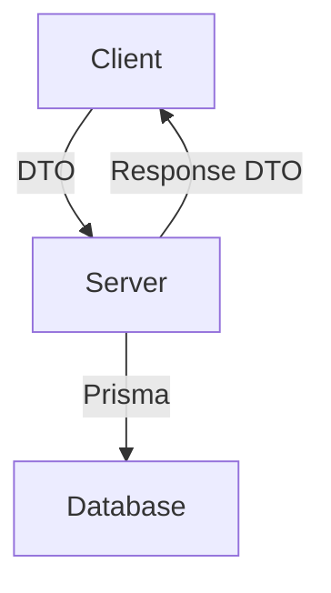

## Architektura modułu `user/dashboard`

### Kierunki komunikacji i podział typów

### Podział odpowiedzialności

| Kierunek        | Typ danych            | Lokalizacja                                           | Cel                          |
| --------------- | --------------------- | ----------------------------------------------------- | ---------------------------- |
| Client ➝ Server | DTO (z walidacją)     | `apps/server/modules/user/dashboard/dashboard.dto.ts` | Walidacja danych wejściowych |
| Server ➝ Client | Output DTO / Response | `packages/types/src/modules/user/dashboard/*.ts`      | Typowanie danych wyjściowych |
| Server ↔ DB     | Model domenowy (ORM)  | `@modulon/database` (Prisma)                          | Obsługa danych w bazie       |

### Zasady i dobre praktyki

* **Input DTO (`*.dto.ts`)**: Tylko do walidacji żądań (`class-validator`), nie eksportowane poza backend.
* **Output DTO (w `@modulon/types`)**: Reprezentują jawne dane wysyłane do klienta (np. `UserAccountData`).
* **Prisma Client (`@modulon/database`)**: Używany tylko po stronie backendu – brak dostępu z klienta.
* **Brak zależności cyklicznych**: `@modulon/types` nie importuje `@modulon/database`.

### Bezpieczeństwo i skalowalność

* Dane wysyłane do klienta są jawnie określone i ograniczone (`Pick`, `Omit`, dedykowane typy)
* Brak wycieku typów domenowych (`password`, `isBlocked`, `canUserEdit`, itd.)
* Wysoka zgodność z zasadami Clean Architecture, SRP i Security by Design
* Łatwa rozbudowa o typy `AdminUserDto`, `MinimalUserDto`, itp.